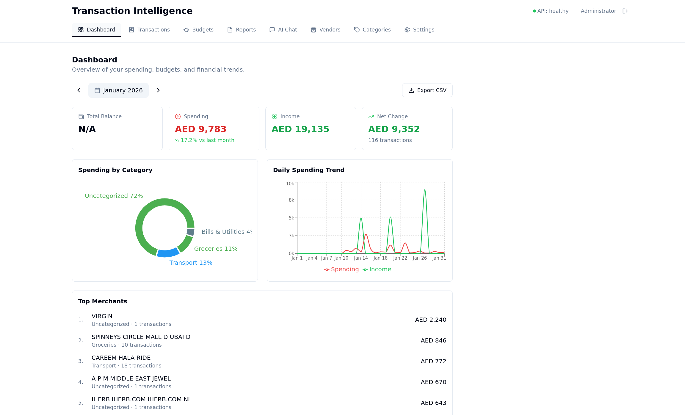
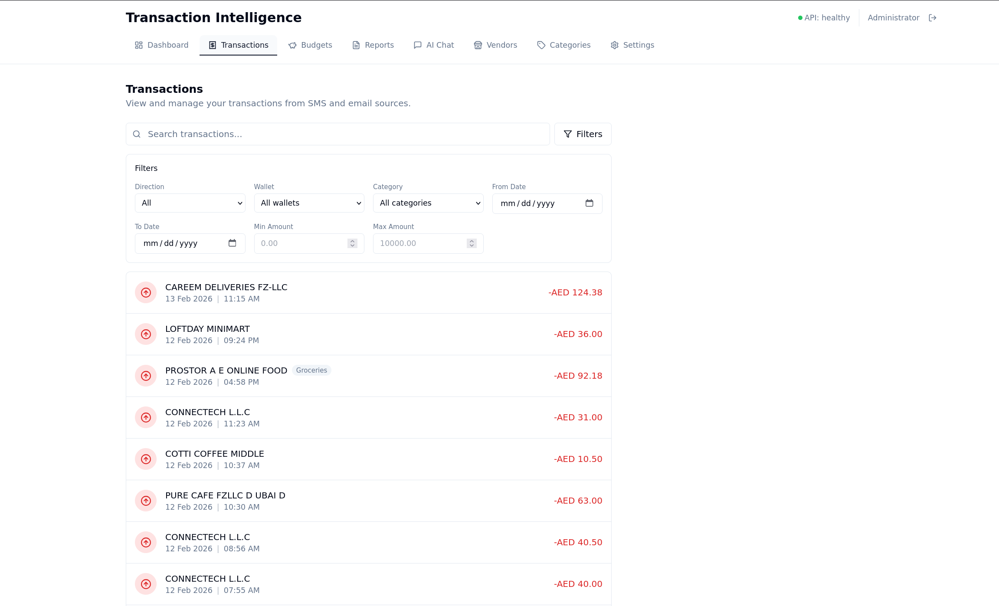
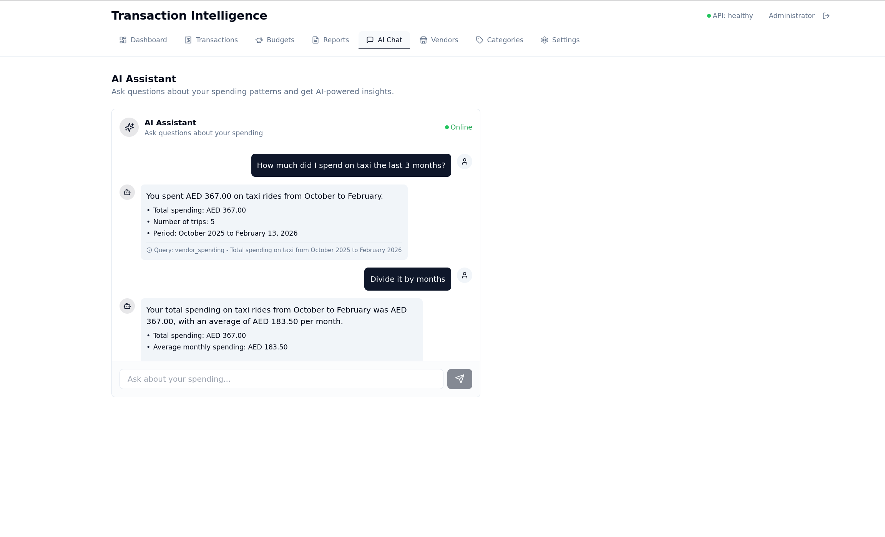

# Transaction Intelligence App

[](https://github.com/alcybersec/transaction_intelligence_app/actions/workflows/ci.yml)
[](LICENSE)
[](docker-compose.yml)

A self-hosted app that ingests SMS (via Android Tasker) and email (via Proton Mail Bridge IMAP), parses bank transaction notifications using pluggable adapters, and serves a modern PWA for analytics, budgeting, and optional local-only AI features via Ollama.

**Your financial data stays on your hardware. No cloud. No third-party access.**



<details>
<summary>More screenshots</summary>




</details>

[](https://github.com/alcybersec/transaction_intelligence_app/releases/download/v1.0.0/Screencast.From.2026-02-13.13-26-14.mp4)

### Highlights

- **Multi-source ingestion** — SMS via Android Tasker webhooks, email via IMAP (Proton Mail Bridge)
- **Pluggable bank adapters** — easily add support for new banks and notification formats
- **Smart deduplication** — transaction evidence from multiple sources is merged into canonical records
- **PWA dashboard** — responsive banking-style UI with analytics, charts, and exports
- **Budgeting** — set and track category/wallet budgets with progress indicators
- **AI features (optional)** — local-only categorization and natural language chat via Ollama
- **Fully Dockerized** — single `make up` to run everything

## Quick Start

### Prerequisites

- Docker and Docker Compose
- Make (optional, for convenience commands)

### Setup

1. Clone the repository:
   ```bash
   git clone https://github.com/alcybersec/transaction_intelligence_app.git
   cd transaction_intelligence_app
   ```

2. Create your environment file:
   ```bash
   cp .env.example .env
   ```

3. Edit `.env` with your configuration (especially secrets for production).

4. Start all services:
   ```bash
   make up
   ```
   Or without Make:
   ```bash
   docker compose up -d
   ```

5. Access the application:
   - **Frontend**: http://localhost:5174
   - **API Docs**: http://localhost:8001/docs
   - **API Health**: http://localhost:8001/health

## Architecture

```
Frontend (React/Vite :5174)
    |
    v  HTTP
API (FastAPI :8001)
    |
    |---> PostgreSQL (transactions, vendors, wallets, budgets)
    +---> Redis (cache + job queue)
              |
              v
         Worker (RQ)
              |
              |---> IMAP (Proton Bridge for email ingestion)
              +---> Ollama (optional AI categorization)
```

**Data flow**: SMS/Email -> Message table -> Bank adapter parses -> TransactionEvidence -> TransactionGroup (canonical) -> Display

### Services

| Service      | Description                                        |
| ------------ | -------------------------------------------------- |
| **api**      | FastAPI backend serving REST endpoints              |
| **frontend** | React PWA with Vite                                |
| **worker**   | Background job processor (RQ) + IMAP email ingestion |
| **postgres** | PostgreSQL database                                |
| **redis**    | Queue and caching                                  |

### External Dependencies

- **Proton Mail Bridge** — runs on host OS, worker connects via IMAP
- **Ollama** (optional) — LAN-accessible for AI categorization and chat

## Project Structure

```
├── backend/          # FastAPI backend API
│   ├── app/
│   │   ├── adapters/ # Pluggable bank parsers (auto-discovered)
│   │   ├── api/      # Route handlers
│   │   ├── services/ # Business logic
│   │   └── db/       # SQLAlchemy models + Alembic migrations
│   └── tests/
├── frontend/         # React + Vite PWA
│   └── src/
├── worker/           # Background job worker
│   ├── app/          # Worker code + IMAP ingestion
│   └── tests/
├── docs/             # Documentation
└── docker-compose.yml
```

## Development

```bash
make up              # Start all services
make down            # Stop all services
make logs            # Tail logs from all services
make build           # Rebuild all containers
make db-migrate      # Run database migrations
make test            # Run all tests (backend + frontend + worker)
make test-backend    # pytest
make test-frontend   # Vitest
make lint            # Run all linters (ruff + ESLint)
make format          # Auto-format all code
make clean           # Remove containers and volumes
```

## Documentation

- [Adding a Bank Adapter](docs/add-bank-adapter.md) — how to add support for a new bank
- [Proton Mail Bridge Setup](docs/proton-bridge-setup.md) — configuring email ingestion
- [Tasker Setup](docs/tasker-setup.md) — configuring Android SMS forwarding
- [Backup & Restore](docs/backup-restore.md) — database backup and recovery

## Contributing

Contributions are welcome! Please read [CONTRIBUTING.md](CONTRIBUTING.md) for development setup, coding standards, and PR guidelines.

## Security

For security-related matters, please see [SECURITY.md](SECURITY.md).

## Built With

- [FastAPI](https://fastapi.tiangolo.com/) — backend API framework
- [React](https://react.dev/) + [Vite](https://vite.dev/) — frontend
- [PostgreSQL](https://www.postgresql.org/) — database
- [Redis](https://redis.io/) + [RQ](https://python-rq.org/) — job queue and caching
- [Ollama](https://ollama.com/) — optional local AI
- [SQLAlchemy](https://www.sqlalchemy.org/) + [Alembic](https://alembic.sqlalchemy.org/) — ORM and migrations

## License

This project is licensed under the MIT License — see [LICENSE](LICENSE) for details.
